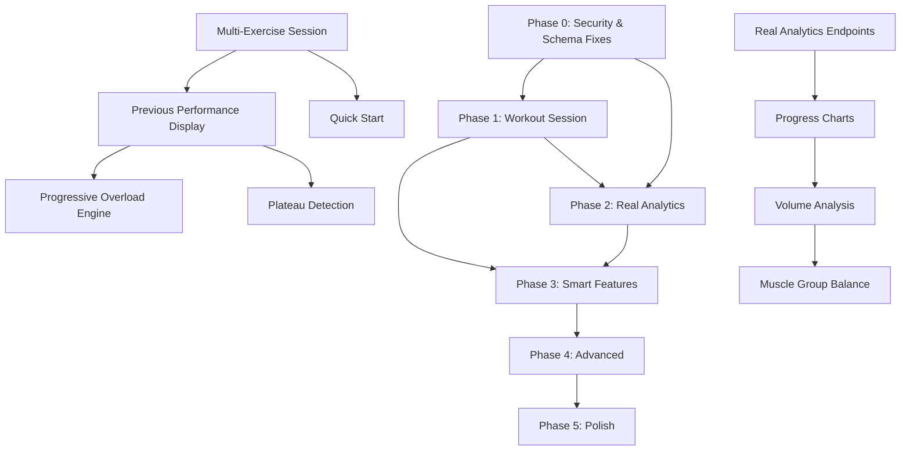

# Workout-Tracker-3 — Complete Product & Technical Audit

---

## 1. EXECUTIVE SUMMARY

**Workout-Tracker-3 (branded "GrindX")** is a React + Express + MongoDB Atlas web application that combines workout tracking, nutrition logging, workout plan building, and analytics. It has an ambitious scope and a significant amount of code (~1,700+ files including node_modules). However, the application suffers from **severe code duplication**, **phantom/dead features**, **hardcoded mock data masquerading as real analytics**, **critical security vulnerabilities**, and a **fragmented architecture** that makes it difficult to maintain or extend.

### Key Findings at a Glance

| Area | Rating | Summary |
|------|--------|---------|
| **Core Workout Logging** | ⚠️ Weak | Exists but UX is exercise-by-exercise, not session-based |
| **Workout History** | ⚠️ Weak | Data is split between localStorage and MongoDB inconsistently |
| **Progress Tracking** | ❌ Fake | Analytics endpoints return hardcoded mock data |
| **Nutrition Tracking** | ✅ Functional | Most complete subsystem; real CRUD with MongoDB |
| **Plan Building** | ✅ Functional | Full CRUD, drag-and-drop builder exists |
| **Exercise Library** | ✅ Good | ~120+ exercises with categories, form tips, videos |
| **Security** | 🔴 Critical | Secrets in .env committed to repo; hardcoded JWT fallback |
| **Code Health** | 🔴 Poor | 36 page files (many duplicates), 70 components, 33 services, 40 utils |
| **Performance** | ⚠️ Concerning | ~20MB of hero images in `src/`; client-side rate limiting patches fetch() |

> [!CAUTION]
> **The .env file containing MongoDB credentials, JWT secret, Cloudinary keys, and Nutritionix API keys is checked into the repository.** This is the highest-priority issue to fix immediately.

---

## 2. CURRENT APPLICATION UNDERSTANDING

### Tech Stack

| Layer | Technology |
|-------|-----------|
| Frontend | React 18 + Vite + TailwindCSS + Framer Motion |
| Backend | Express 4 (ESM) + Mongoose 8 |
| Database | MongoDB Atlas (free tier) |
| Auth | JWT (30-day expiry) + bcryptjs |
| Charts | Chart.js + Recharts (both installed — duplicative) |
| Image Upload | Cloudinary (paid service dependency) |
| Nutrition API | Nutritionix (paid API, keys in .env) |
| Deployment targets | Netlify (frontend) + Render (backend) |

### Route Map (Frontend)

| Route | Page | Status |
|-------|------|--------|
| `/` | Home | ✅ Working (marketing page) |
| `/register` | Register | ✅ Working |
| `/login` | Login | ✅ Working |
| `/dashboard` | Dashboard | ⚠️ Partially working (mix of real + fake data) |
| `/library` | LibrarySimple | ✅ Working |
| `/analytics` | Analytics | ❌ **Fake data** — backend returns hardcoded arrays |
| `/nutrition` | Nutrition | ✅ Mostly working |
| `/plans` | PlansBuilder | ✅ Working |
| `/my-plans` | MyPlans | ✅ Working |
| `/splits` & `/workout-splits` | WorkoutSplits | ✅ Working (static data) |
| `/custom-split-builder` | CustomSplitBuilder | ✅ Working (localStorage only) |
| `/your-workout-splits` | YourWorkoutSplits | ✅ Working |
| `/start-workout` | StartWorkout | ⚠️ Works but single-exercise flow |
| `/workouts` | Workouts | ⚠️ Multiple duplicate versions exist |
| `/profile` | Profile | ✅ Working |
| `/settings` | Settings | ✅ Working (extensive) |
| `/forum` | Forum | ❌ Shell only — no real backend |
| `/contact` | Contact | ✅ Working (static) |
| `/legends` | LegendsAndInfluencers | ❌ Content page — no real utility |
| `/search` | Search (inline) | ❌ Hardcoded 5-exercise array |

### API Routes (Backend)

| Route | Description | Data Source |
|-------|-------------|-------------|
| `/api/auth` | Register, Login | ✅ MongoDB |
| `/api/users` | Profile, Settings, Stats | ✅ MongoDB |
| `/api/exercises` | Exercise CRUD | ✅ MongoDB |
| `/api/plans` | Plan CRUD | ✅ MongoDB |
| `/api/workouts` | Workout CRUD | ✅ MongoDB |
| `/api/meals` | Meal CRUD | ✅ MongoDB |
| `/api/nutrition` | Meal tracking, food search, targets | ✅ MongoDB + Nutritionix |
| `/api/analytics/stats` | **Hardcoded mock stats** | ❌ Fake |
| `/api/analytics/calories` | **Hardcoded mock calorie data** | ❌ Fake |
| `/api/analytics/frequency` | **Hardcoded mock frequency** | ❌ Fake |
| `/api/analytics/muscles` | **Hardcoded mock muscle data** | ❌ Fake |
| `/api/analytics/hero-stats` | Real stats from MongoDB | ✅ Real |
| `/api/analytics/achievements` | Achievement system (references missing model) | ❌ Broken |
| `/api/dashboard` | Dashboard data | ⚠️ Minimal |
| `/api/reviews` | Exercise reviews | ✅ MongoDB |
| `/api/sync` | Offline sync | ⚠️ Partially implemented |
| `/api/workout-splits` | Workout split templates | Static in-memory data |

---

## 3. CURRENT FEATURE INVENTORY

| Feature | Current State | Value | Problems | Recommendation | Priority |
|---------|--------------|-------|----------|----------------|----------|
| **User Auth (Register/Login)** | ✅ Working | High | Secrets exposed; 30-day token; no refresh token | **IMPROVE** | P0 |
| **Dashboard** | ⚠️ Partial | High | Mixed real/fake data; 108KB component file | **REDESIGN** | P1 |
| **Exercise Library** | ✅ Good | High | Client-side data only; good variety (~120 exercises) | **KEEP** | — |
| **Plan Builder** | ✅ Working | High | Complex but functional; drag-and-drop | **KEEP** | — |
| **My Plans** | ✅ Working | High | CRUD works; MongoDB sync | **KEEP** | — |
| **Start Workout** | ⚠️ Partial | Critical | Single-exercise-at-a-time flow; no multi-exercise sessions | **REDESIGN** | P0 |
| **Workout History** | ⚠️ Weak | High | Multiple duplicate page files; fragmented data | **REDESIGN** | P1 |
| **Nutrition Tracking** | ✅ Working | Medium | Depends on Nutritionix API; good local food DB | **IMPROVE** | P2 |
| **Analytics** | ❌ Fake | High | 4 endpoints return hardcoded mock arrays | **REDESIGN** | P1 |
| **Personal Records** | ⚠️ Client-only | High | localStorage-based PR tracking; no backend persistence | **IMPROVE** | P1 |
| **Achievements/XP** | ❌ Broken | Low | References missing Achievement model; gamification bloat | **REMOVE** | P2 |
| **Forum** | ❌ Shell | Low | Post model exists but no real community features | **REMOVE** | — |
| **Legends & Influencers** | ❌ Content | None | Static content page with no user value | **REMOVE** | — |
| **Review System** | ⚠️ Partial | Low | Exercise reviews exist but stored in localStorage on frontend | **REMOVE** (for now) | P3 |
| **Workout Splits (Templates)** | ✅ Working | Medium | Static in-memory data; only 3 templates | **IMPROVE** | P2 |
| **Custom Split Builder** | ✅ Working | Medium | localStorage-based; functional | **KEEP** | — |
| **Rest Timer** | ✅ Working | High | Built into StartWorkout; functional | **KEEP** | — |
| **Profile + Settings** | ✅ Working | Medium | Extensive settings; some have no backend effect | **IMPROVE** | P2 |
| **Search** | ❌ Broken | Medium | Hardcoded 5-exercise array inline in App.jsx | **REDESIGN** | P2 |
| **Image Upload** | ✅ Working | Low | Cloudinary dependency (paid beyond free tier) | **IMPROVE** | P3 |
| **Offline Support** | ⚠️ Partial | Medium | Sync endpoints exist but inconsistent implementation | **IMPROVE** | P3 |
| **Theme System** | ✅ Working | Low | Dark mode primary; light mode has 7+ fix CSS files | **IMPROVE** | P3 |

---

## 4. FEATURES TO KEEP ✅

1. **Exercise Library** — ~120+ exercises across chest, back, legs, shoulders, arms, abs with difficulty, type (compound/isolation), video links, form tips. This is genuinely useful.
2. **Plan Builder** — Full CRUD with drag-and-drop exercise reordering. Saves to MongoDB.
3. **My Plans** — View, edit, delete plans. Start workout from plan.
4. **Rest Timer** — Built into StartWorkout with configurable rest periods.
5. **Custom Split Builder** — Users can create custom workout splits.
6. **Nutrition CRUD** — Meal logging with macros (protein, carbs, fat, calories) to MongoDB.
7. **Food Database** — Local food database with ~200+ items, categories, search.
8. **Profile Picture** — Upload with crop functionality.
9. **Auth System** — Core JWT auth works correctly.

---

## 5. FEATURES TO IMPROVE ⬆️

### 5.1 Authentication & Security
- **Problem**: JWT secret hardcoded as fallback in middleware; `.env` committed to git; 30-day tokens with no refresh mechanism.
- **Action**: Remove hardcoded secret fallback, add `.env` to `.gitignore`, implement token refresh, rotate exposed secrets.

### 5.2 Personal Records (PR) Tracking
- **Problem**: Stored entirely in localStorage via `PRService`. Lost when clearing browser data. Not synced to backend.
- **Action**: Add PR model/endpoint to backend; sync PRs from localStorage to MongoDB.

### 5.3 Nutrition Tracking
- **Problem**: Depends on Nutritionix API (has API keys in `.env`). Good local food database exists as fallback.
- **Action**: Make local food database the primary source; keep Nutritionix as optional enhancement.

### 5.4 Workout Splits Templates
- **Problem**: Only 3 hardcoded templates (PPL, Upper/Lower, Full Body). Stored as static array in route file.
- **Action**: Expand to 8-10 templates covering more use cases. Store in database or seed file.

### 5.5 Profile & Settings
- **Problem**: Many settings (language, data retention, sync across devices) have no backend implementation — they save to the model but nothing reads them.
- **Action**: Remove non-functional settings or implement them. Keep preferences that actually work.

---

## 6. FEATURES TO REDESIGN 🔄

### 6.1 Start Workout Flow (CRITICAL)
- **Current**: User navigates to an exercise → clicks "Start Workout" → logs sets for ONE exercise → completes. This is not how anyone works out.
- **Problem**: Real gym sessions involve 4-8 exercises. The current flow makes it impossible to log a complete workout session.
- **Redesign**: Create a proper **Workout Session** page: select plan (or freestyle) → see all exercises → log sets for each → complete session → save entire workout.

### 6.2 Analytics (CRITICAL)
- **Current**: `/api/analytics/stats`, `/calories`, `/frequency`, `/muscles` all return hardcoded fake data.
- **Problem**: Users see fake numbers. This destroys trust and provides zero value.
- **Redesign**: Replace all mock endpoints with real MongoDB aggregation queries against actual workout and meal data.

### 6.3 Dashboard
- **Current**: 108KB component file mixing real hero-stats with decorative elements.
- **Problem**: Bloated, slow, mixes real and fake data sources.
- **Redesign**: Simplify to show: today's activity, weekly progress, recent workouts, next planned workout, streak.

### 6.4 Workout History
- **Current**: Multiple duplicate files — `Workouts.jsx`, `WorkoutsFixed.jsx`, `WorkoutsComplete.jsx`, `WorkoutsTest.jsx`.
- **Problem**: Unclear which is the "real" one. Data split between localStorage and MongoDB.
- **Redesign**: Single `WorkoutHistory.jsx` backed entirely by MongoDB.

### 6.5 Search
- **Current**: Hardcoded 5-exercise array inline in `App.jsx` (lines 64-100).
- **Problem**: Completely non-functional. Should search the exercise library.
- **Redesign**: Search against `exerciseLibrary.js` data and backend exercises.

---

## 7. FEATURES TO REMOVE ❌

### 7.1 Achievement/XP/Gamification System
- **Why**: References a `models/Achievement.js` that doesn't exist (will crash). The XP point system is arbitrary (100 per workout, 50 per meal) and doesn't provide actionable fitness insight. Gamification without substance adds complexity.
- **Impact**: Remove ~200 lines from analytics.js, remove XP references from dashboard.

### 7.2 Forum
- **Why**: `Post.js` model exists, `routes/posts.js` has basic CRUD, but `Forum.jsx` is a 61KB component with no real community backend. Building a proper forum is out of scope for a workout tracker.
- **Impact**: Remove `Post.js` model, `routes/posts.js`, `Forum.jsx`. Remove nav link.

### 7.3 Legends & Influencers Page
- **Why**: Static content page about bodybuilding legends. Provides no functional value to the workout tracking experience.
- **Impact**: Remove `LegendsAndInfluencers.jsx`. Remove nav link.

### 7.4 Review System (Deprioritize)
- **Why**: Exercise reviews are interesting but the current implementation stores reviews in localStorage on the frontend, not in the backend Review model. It's partially implemented and low priority.
- **Impact**: Remove from UI for now. Keep Review model for future implementation.

### 7.5 Duplicate Page Files
- **Why**: `Dashboard-simple.jsx`, `Home-simple.jsx`, `PlansBuilder-Fixed.jsx`, `PlansBuilder-HTML5.jsx`, `ProfileAdvanced.jsx`, `ProfileEnhanced.jsx`, `WorkoutsFixed.jsx`, `WorkoutsComplete.jsx`, `WorkoutsTest.jsx`, `Hero-backup.jsx`, `HeroSimple.jsx`, `LightModeTest.jsx` are all dead/duplicate files.
- **Impact**: Remove ~15 dead files, reducing cognitive load.

### 7.6 Excessive Error Suppression
- **Why**: `errorSuppression.js`, `errorSuppressor.js`, `finalErrorCleanup.js`, `comprehensiveErrorHandler.js`, `silentMode.js`, `immediateCleanup.js`, `consoleFilter.js` — these mask bugs rather than fixing them. The `main.jsx` monkey-patches `window.fetch` to swallow API errors.
- **Impact**: Remove suppression layers; fix actual errors.

---

## 8. CURRENTLY MISSING FEATURES

### 8.1 Multi-Exercise Workout Sessions (**P0**)

| Field | Detail |
|-------|--------|
| **FEATURE** | Log a complete workout session with multiple exercises |
| **REAL-WORLD PROBLEM** | Users cannot log a typical gym session (4-8 exercises) in one flow |
| **WHY USERS NEED IT** | This is THE core function of any workout tracker |
| **HOW IT SHOULD WORK** | Start session → select/add exercises → log sets for each → complete → save |
| **DATA REQUIRED** | Workout model already supports multiple exercises with sets |
| **BACKEND REQUIREMENTS** | Existing POST `/api/workouts` already handles it |
| **FRONTEND REQUIREMENTS** | New `WorkoutSession.jsx` with multi-exercise UI |
| **ALGORITHM/LOGIC** | None — straightforward CRUD |
| **FREE TECHNOLOGY** | Existing stack |
| **COMPLEXITY** | Medium |
| **USER VALUE** | ★★★★★ — Without this, the app is not usable as a daily tracker |
| **PRIORITY** | P0 |
| **DEPENDENCIES** | None |
| **POTENTIAL RISKS** | Must handle mid-session crashes (auto-save to localStorage) |

### 8.2 Previous Performance Visibility (**P0**)

| Field | Detail |
|-------|--------|
| **FEATURE** | Show last workout's weight/reps for each exercise while logging |
| **REAL-WORLD PROBLEM** | Users forget what weight they used last time |
| **WHY USERS NEED IT** | #1 most-requested feature in every workout tracker user study |
| **HOW IT SHOULD WORK** | When logging sets, show "Last time: 3×10 @ 60kg" next to each exercise |
| **DATA REQUIRED** | Query workout history by exercise name for current user |
| **BACKEND REQUIREMENTS** | GET `/api/workouts/exercise-history/:exerciseName` |
| **FRONTEND REQUIREMENTS** | Small info card in set logging UI |
| **ALGORITHM/LOGIC** | Simple query: find last workout containing this exercise |
| **FREE TECHNOLOGY** | Existing MongoDB |
| **COMPLEXITY** | Low |
| **USER VALUE** | ★★★★★ |
| **PRIORITY** | P0 |

### 8.3 Real Analytics from Actual Data (**P1**)

| Field | Detail |
|-------|--------|
| **FEATURE** | Replace fake analytics with real MongoDB aggregations |
| **REAL-WORLD PROBLEM** | Analytics page shows fake data — users see numbers that aren't theirs |
| **DATA REQUIRED** | Existing Workout and Meal collections |
| **BACKEND REQUIREMENTS** | Replace 4 hardcoded endpoints with real aggregation queries |
| **COMPLEXITY** | Medium |
| **USER VALUE** | ★★★★★ |
| **PRIORITY** | P1 |

### 8.4 Progressive Overload Suggestions (**P1**)

| Field | Detail |
|-------|--------|
| **FEATURE** | Suggest next workout's weight/reps based on performance trend |
| **REAL-WORLD PROBLEM** | Users don't know when/how to increase weight |
| **HOW IT SHOULD WORK** | If user completed all prescribed reps across all sets, suggest +2.5kg next session |
| **ALGORITHM/LOGIC** | Rule-based: If (all sets at target reps for 2 consecutive sessions) → suggest weight increase. No AI needed. |
| **FREE TECHNOLOGY** | Pure JavaScript calculation |
| **COMPLEXITY** | Low-Medium |
| **USER VALUE** | ★★★★☆ |
| **PRIORITY** | P1 |

### 8.5 Workout Streak & Consistency Tracking (**P1**)

| Field | Detail |
|-------|--------|
| **FEATURE** | Real streak calculation from actual workout dates |
| **REAL-WORLD PROBLEM** | Current streak calculation queries DB day-by-day in a while loop (N+1) |
| **ALGORITHM/LOGIC** | Single aggregation: group workouts by date → find consecutive days |
| **COMPLEXITY** | Low |
| **USER VALUE** | ★★★☆☆ |
| **PRIORITY** | P1 |

### 8.6 1RM Estimation (**P2**)

| Field | Detail |
|-------|--------|
| **FEATURE** | Estimate one-rep max from logged sets |
| **ALGORITHM/LOGIC** | Epley formula: `1RM = weight × (1 + reps/30)`. No AI needed. |
| **COMPLEXITY** | Trivial |
| **USER VALUE** | ★★★★☆ |
| **PRIORITY** | P2 |

### 8.7 Volume Tracking per Muscle Group (**P2**)

| Field | Detail |
|-------|--------|
| **FEATURE** | Weekly sets-per-muscle-group chart |
| **REAL-WORLD PROBLEM** | Users don't know if they're training muscle groups equally |
| **ALGORITHM/LOGIC** | Map exercises to muscle groups (exercise library already has this data) → sum sets |
| **COMPLEXITY** | Medium |
| **USER VALUE** | ★★★★☆ |
| **PRIORITY** | P2 |

### 8.8 "Repeat Last Workout" / Quick Start (**P2**)

| Field | Detail |
|-------|--------|
| **FEATURE** | One-tap button to start the same workout as last time |
| **REAL-WORLD PROBLEM** | Excessive tapping to set up each workout |
| **COMPLEXITY** | Low |
| **USER VALUE** | ★★★★☆ |
| **PRIORITY** | P2 |

---

## 9. REAL-WORLD PROBLEMS THE APP SHOULD SOLVE

| Problem | Severity | Currently Solved? |
|---------|----------|-------------------|
| **"What weight did I use last time?"** | Critical | ❌ No |
| **"I want to log my full gym session"** | Critical | ❌ No (single-exercise flow) |
| **"Am I making progress?"** | High | ❌ No (fake analytics) |
| **"What should I increase next?"** | High | ❌ No |
| **"Am I training all muscle groups?"** | Medium | ❌ No (fake muscle distribution) |
| **"What's my PR on bench press?"** | Medium | ⚠️ Client-only, not persistent |
| **"I want to quickly repeat yesterday's workout"** | Medium | ❌ No |
| **"How consistent am I?"** | Medium | ⚠️ Streak exists but calculated inefficiently |
| **"My estimated 1RM?"** | Medium | ❌ No |
| **"Rest timer between sets"** | Medium | ✅ Yes |
| **"I need a workout plan"** | Medium | ✅ Yes (plan builder works) |

---

## 10. TOP HIGH-VALUE / KILLER FEATURES

### 🏆 1. Multi-Exercise Workout Session Logger
**Why it's a killer feature**: This is table-stakes. Without it, the app cannot function as a daily-use workout tracker. The current single-exercise flow is a dealbreaker.

### 🏆 2. "Last Time" Performance Display
**Why it's a killer feature**: This single feature is cited as the #1 reason users stick with apps like Strong, Hevy, and JEFIT. Seeing your previous performance removes the biggest daily friction: "what weight do I use?"

### 🏆 3. Real Progress Analytics
**Why it's a killer feature**: Replacing fake data with real charts showing strength progression over time, volume trends, and consistency gives users the "why" for continuing to track.

### 🏆 4. Progressive Overload Engine (Rule-Based)
**Why it's a killer feature**: Most apps just show data. An app that tells you "add 2.5kg to bench press today based on your last 2 sessions" crosses from passive tracker to active training partner. This is pure math — no AI needed.

### 🏆 5. 1RM Estimation & PR Board
**Why it's a killer feature**: Estimated 1RM gives meaning to submaximal training. A PR board across all exercises creates personal competition and motivation.

### 🏆 6. Volume per Muscle Group
**Why it's a killer feature**: Exposes imbalances (skipping legs, overtraining chest) using data the user is already logging. Minimal effort → maximum insight.

### 🏆 7. Quick Start / Repeat Workout
**Why it's a killer feature**: Reduces workout start time from 2+ minutes to 1 tap. Directly reduces friction.

### 🏆 8. Plateau Detection (Rule-Based)
**Why it's a killer feature**: If weight hasn't increased for an exercise across 4+ sessions, flag it. Simple comparison — no AI. Provides actionable insight most users miss.

---

## 11. SMART FEATURES WITHOUT PAID AI

| Feature | Algorithm | AI Needed? |
|---------|-----------|------------|
| **Progressive Overload Suggestions** | If all sets hit target reps for 2 sessions → +2.5kg | ❌ No — rule-based |
| **Plateau Detection** | If weight unchanged for 4+ sessions → flag | ❌ No — comparison |
| **1RM Estimation** | Epley: weight × (1 + reps/30) | ❌ No — formula |
| **PR Detection** | Compare new set against historical max | ❌ No — max comparison |
| **Volume Analysis** | Sum sets × reps × weight per muscle group | ❌ No — arithmetic |
| **Consistency Score** | workouts_this_week / target_per_week | ❌ No — division |
| **Workout Frequency Heatmap** | Count workouts per day/week | ❌ No — aggregation |
| **Deload Suggestion** | If RPE/volume trending up for 4+ weeks → suggest deload | ❌ No — trend comparison |
| **"What should I do today?"** | If following a plan → show today's workout | ❌ No — calendar lookup |
| **Muscle Group Balance** | Compare set counts across muscle groups | ❌ No — aggregation |

> [!NOTE]
> **Every "smart" feature listed above can be implemented with deterministic math and simple comparisons.** AI is NOT needed for any of them.

---

## 12. DATA MODEL / DATABASE GAPS

### Current Models vs. Required

| Model | Exists? | Status | Gaps |
|-------|---------|--------|------|
| `User` | ✅ | Good | Missing: body weight history, height, age (for 1RM context) |
| `Exercise` | ✅ | Adequate | Missing: primaryMuscle, secondaryMuscles (has `muscles: [String]` but loosely structured) |
| `Workout` | ✅ | **Weak** | Missing: `completed` field (referenced in queries but not in schema), `status` (in-progress/completed), `completedAt` |
| `Plan` | ✅ | Over-engineered | Has engagement, performance, sync metadata — most unused. Good core structure. |
| `Food` | ✅ | Good | Well-structured with serving sizes and nutrition data |
| `Meal` | ✅ | Adequate | Works fine |
| `NutritionGoal` | ✅ | Good | Has TDEE calculation fields |
| `Post` | ✅ | **Remove** | Forum feature not implemented |
| `Review` | ✅ | Deprioritize | Not connected to frontend properly |
| `Achievement` | ❌ **Missing** | Broken | Referenced in analytics.js but model doesn't exist — will crash |

### Critical Schema Fix — Workout Model

The Workout model needs:
```
status: { type: String, enum: ['in-progress', 'completed', 'abandoned'], default: 'in-progress' }
completedAt: Date
totalVolume: Number  // Calculated on save
```

The `completed: true` field is queried in analytics but doesn't exist in the schema — meaning those queries always return 0.

### Data We Should NOT Collect
- Social graph / friends lists (no social features planned)
- GPS / location data
- Heart rate / wearable data (adds complexity, requires integrations)
- Detailed body measurements beyond body weight (unnecessary complexity for most users)

---

## 13. UX / WORKOUT FLOW GAPS

### Current Flow (Broken)
```
Library → Pick 1 exercise → Setup modal → Start Workout page → Log sets → Complete → Back to Library
```
**Problem**: User must repeat this for EVERY exercise. A 6-exercise workout requires 6 separate navigation cycles.

### Proposed Flow (Correct)
```
Dashboard → "Start Workout" → Choose: Plan workout OR Freestyle
  → Plan: Auto-loads exercises → Log sets for each → Complete
  → Freestyle: Add exercises on-the-fly → Log sets → Complete
→ Save all exercises as single Workout document → Show summary
```

### Additional UX Issues

| Issue | Severity | Detail |
|-------|----------|--------|
| **No previous weight visibility** | Critical | User has no reference for what to lift |
| **~20MB of hero images in `src/`** | High | 7 JPEG files (2-4MB each) bundled into app |
| **Dashboard is 108KB JSX** | Medium | Single monolithic component |
| **App.jsx is 1070 lines** | Medium | Contains inline Search and ExerciseDetail components with `React.createElement` calls (transpiled JSX?) |
| **7 light-mode fix CSS files** | Medium | Indicates broken theme system patched repeatedly |
| **No loading states in workout flow** | Medium | API calls have no feedback |
| **Navigation unclear for new users** | Medium | Too many nav items (Library, Plans, Splits, etc.) |

---

## 14. TECHNICAL ARCHITECTURE AUDIT

### Frontend

| Area | Assessment |
|------|-----------|
| **Component Architecture** | 🔴 70 components, many duplicates (3 profile variants, 4 workout page variants, 3 hero variants) |
| **State Management** | ⚠️ 4 contexts + heavy localStorage usage. RealTimeContext does polling, not real-time. |
| **Service Layer** | 🔴 33 service files with massive overlap (e.g., `workoutService`, `workoutServiceReal`, `workoutSync`, `realTimeWorkoutSync`, `workoutCompletionService`, `workoutCompletionFallback`, `workoutBackendExample`) |
| **Utils** | 🔴 40 utility files — many are one-time cleanup scripts left in the codebase |
| **CSS** | ⚠️ TailwindCSS + 31 custom CSS files + inline styles. 7 "light-mode-fix" files indicate broken theming. |
| **Bundle Size** | 🔴 ~20MB of hero images in `src/`. Two charting libraries (Chart.js + Recharts). Particles library. Framer Motion. |
| **Code Quality** | ⚠️ App.jsx contains ~800 lines of transpiled `React.createElement` code (not JSX). Likely generated by a transpiler and not cleaned up. |

### Backend

| Area | Assessment |
|------|-----------|
| **API Design** | ⚠️ Mostly RESTful. Inconsistent response shapes (`{ workout }` vs `{ success, data }` vs `{ success, plans }`). |
| **Validation** | ⚠️ Basic field presence checks. No schema validation library (Joi, Zod). |
| **Error Handling** | ✅ Global error middleware exists. Error types handled (file size, multer). |
| **Security Middleware** | 🔴 Helmet imported in package.json but **never used** in server.js. Rate limiter exists. |
| **Test Files** | ⚠️ 8 test files in backend root — ad-hoc scripts, not proper tests. |
| **Dead Code** | `global.io` Socket.IO references in Plan model — Socket.IO is not installed. |

---

## 15. SECURITY AUDIT

| Issue | Severity | Detail |
|-------|----------|--------|
| **Secrets in repository** | 🔴 CRITICAL | `.env` with MongoDB URI (username+password), JWT secret, Cloudinary keys, Nutritionix keys committed to git |
| **Hardcoded JWT fallback** | 🔴 CRITICAL | `auth.js` middleware: `process.env.JWT_SECRET \|\| 'workout_tracker_super_secret_jwt_key_2024...'` — if env var missing, uses hardcoded secret |
| **Password in error message** | 🔴 HIGH | `server.js` line 252: `console.error('6. Make sure to replace <password> with: aravvvvc1')` — logs actual DB password |
| **Helmet not used** | ⚠️ HIGH | Installed as dependency but never imported/used in server.js |
| **CORS allows all origins** | ⚠️ HIGH | Line 64: `callback(null, true); // Allow all origins in production for now` |
| **No input sanitization** | ⚠️ MEDIUM | User inputs are not sanitized against XSS. `Object.assign(workout, req.body)` in PUT allows mass assignment. |
| **30-day token, no refresh** | ⚠️ MEDIUM | JWT expires in 30 days. No refresh token mechanism. If token is stolen, attacker has access for 30 days. |
| **Verbose error logging** | ⚠️ LOW | Full stack traces logged to console in production; some error responses include `error.message` |

---

## 16. PERFORMANCE AUDIT

| Issue | Impact | Fix |
|-------|--------|-----|
| **~20MB hero images in src/** | 🔴 Severe bundle size | Move to `public/` with proper optimization; use WebP format |
| **Two charting libraries** | ⚠️ Bundle bloat | Pick one (Recharts is more React-native); remove Chart.js |
| **Particles library** | ⚠️ CPU + bundle | Decorative only; remove or lazy-load |
| **Streak calculation N+1** | ⚠️ DB load | Queries DB in a while loop, one query per day. Use aggregation. |
| **Duplicate meal count queries** | ⚠️ DB load | Queries both `{ userId }` and `{ user }` every time + auto-migration on every request |
| **Client-side fetch monkey-patch** | ⚠️ Fragility | `main.jsx` overrides `window.fetch` globally to add rate limiting and error swallowing |
| **No pagination** | ⚠️ DB load | Workout history loads ALL workouts. No limit/offset. |
| **localStorage abuse** | ⚠️ Storage limits | PRs, completed workouts, plans, splits, meals, reviews all stored in localStorage |

---

## 17. ZERO-BUDGET TECHNOLOGY STRATEGY

| Need | Existing Technology | Free Alternative if Needed |
|------|-------------------|---------------------------|
| **Database** | MongoDB Atlas (Free M0 tier — 512MB) | ✅ Sufficient for single-user/demo |
| **Backend hosting** | Render free tier | ✅ Spins down after inactivity but works |
| **Frontend hosting** | Netlify free tier | ✅ Excellent for SPAs |
| **Image storage** | Cloudinary (free: 25GB bandwidth/mo, 25K transforms) | ✅ Free tier sufficient for profile pics |
| **Nutrition data** | Nutritionix API (requires signup) | ✅ Use local food database as primary — already 200+ items |
| **Charts** | Recharts (already installed, free) | ✅ Remove Chart.js, keep Recharts |
| **Auth** | JWT + bcrypt (free) | ✅ Already implemented |
| **AI features** | NOT NEEDED | All "smart" features use deterministic math |
| **Exercise videos** | YouTube embeds (free) | ✅ Already using YouTube links |
| **Offline support** | localStorage + IndexedDB | ✅ Use Service Worker for PWA if needed |

> [!IMPORTANT]
> **No paid services are required for any recommended feature.** All "smart" features use mathematical formulas, not AI. The existing MongoDB Atlas free tier, Render free tier, and Netlify free tier are sufficient.

---

## 18. PRIORITIZED IMPLEMENTATION ROADMAP

### PHASE 0 — Fix Critical Issues (1-2 days)
| Task | Effort | Impact |
|------|--------|--------|
| Add `.env` to `.gitignore`, rotate all exposed secrets | Low | 🔴 Critical |
| Remove hardcoded JWT fallback from auth middleware | Trivial | 🔴 Critical |
| Remove password from server.js console.error | Trivial | 🔴 Critical |
| Add Helmet middleware to server.js | Trivial | High |
| Fix Workout schema: add `status`, `completedAt`, `completed` field | Low | High |
| Remove references to missing Achievement model | Low | High (prevents crashes) |
| Delete dead/duplicate page files (15+ files) | Low | Medium |
| Remove error suppression layers | Medium | Medium |

### PHASE 1 — Core Workout Experience (3-5 days)
| Task | Effort | Impact |
|------|--------|--------|
| Build proper multi-exercise Workout Session page | High | ★★★★★ |
| Add "Last Time" performance display for each exercise | Medium | ★★★★★ |
| Add exercise history API endpoint | Low | ★★★★★ |
| Implement Quick Start / Repeat Last Workout | Medium | ★★★★☆ |
| Add auto-save to localStorage during active session | Medium | ★★★★☆ |
| Fix and unify Workout History page (single version) | Medium | ★★★★☆ |

### PHASE 2 — Progress & Analytics (2-3 days)
| Task | Effort | Impact |
|------|--------|--------|
| Replace all fake analytics endpoints with real MongoDB aggregations | Medium | ★★★★★ |
| Implement exercise-specific progress charts (weight over time) | Medium | ★★★★☆ |
| Build 1RM estimation (Epley formula) | Trivial | ★★★★☆ |
| Persist PRs to backend | Low | ★★★★☆ |
| Build PR Board page | Medium | ★★★☆☆ |
| Volume per muscle group chart | Medium | ★★★★☆ |
| Workout frequency heatmap/calendar | Medium | ★★★☆☆ |

### PHASE 3 — Intelligent Fitness Features (2-3 days)
| Task | Effort | Impact |
|------|--------|--------|
| Progressive overload suggestion engine (rule-based) | Medium | ★★★★★ |
| Plateau detection (flag exercises with no progress) | Low | ★★★★☆ |
| Deload suggestion (after 4+ weeks of increasing volume) | Low | ★★★☆☆ |
| Consistency scoring | Low | ★★★☆☆ |
| Muscle group balance analysis | Medium | ★★★★☆ |

### PHASE 4 — Advanced Features (3-5 days)
| Task | Effort | Impact |
|------|--------|--------|
| Expand workout split templates (8-10 templates) | Medium | ★★★☆☆ |
| Fix search to query exercise library properly | Low | ★★★☆☆ |
| Dashboard redesign (simplified, real data only) | High | ★★★★☆ |
| Fix theme system (eliminate 7 CSS fix files) | Medium | ★★★☆☆ |
| Improve navigation structure | Medium | ★★★☆☆ |
| Remove Nutritionix dependency (local food DB primary) | Low | ★★☆☆☆ |

### PHASE 5 — Polish & Production Readiness (2-3 days)
| Task | Effort | Impact |
|------|--------|--------|
| Move hero images to `public/`, convert to WebP | Low | High (bundle size) |
| Remove Chart.js, particles library | Low | Medium |
| Add API response pagination | Medium | Medium |
| Fix localStorage → use backend as source of truth | Medium | High |
| Normalize API response shapes | Medium | Medium |
| Add input validation (Zod/Joi) | Medium | Medium |
| Add proper loading/error/empty states | Medium | Medium |
| Clean up App.jsx (convert React.createElement back to JSX) | Medium | Medium |
| Basic integration tests for critical flows | Medium | Medium |

---

## 19. FEATURE DEPENDENCY MAP



---

## 20. MVP / V1 / V2 FEATURE BOUNDARIES

### MVP (Phase 0 + Phase 1) — "It Actually Works"
- ✅ Secure auth (rotated secrets, helmet)
- ✅ Multi-exercise workout session logging
- ✅ "Last time" weight/reps display
- ✅ Quick Start / Repeat Last Workout
- ✅ Single unified workout history page
- ✅ Exercise library (already exists)
- ✅ Plan builder (already exists)
- ✅ Nutrition tracking (already exists)

### V1 (+ Phase 2 + Phase 3) — "It's Actually Useful"
- ✅ Everything in MVP
- ✅ Real analytics (progress charts, volume, frequency)
- ✅ 1RM estimation
- ✅ PR Board (persisted to backend)
- ✅ Progressive overload suggestions
- ✅ Plateau detection
- ✅ Muscle group balance analysis
- ✅ Consistency scoring

### V2 (+ Phase 4 + Phase 5) — "It's Polished"
- ✅ Everything in V1
- ✅ Redesigned dashboard (real data, fast, useful)
- ✅ Fixed theme system
- ✅ Optimized bundle (WebP images, single chart library)
- ✅ Proper error handling and loading states
- ✅ API pagination
- ✅ Cleaned codebase

---

## 21. FINAL PRODUCT VISION

### WHO IT IS FOR
Gym-goers of all levels (beginner through advanced) who want a **free, no-BS workout tracker** that helps them train progressively and see real progress — not a social media platform disguised as a fitness app.

### WHAT PROBLEM IT SOLVES
The two most common problems in the gym:
1. **"What weight did I use last time?"** — Instant access to previous performance.
2. **"Am I actually getting stronger?"** — Real progress charts and insights from your own data.

### WHY USERS WOULD USE IT
- **Zero cost** — completely free with no premium lock
- **Fast logging** — start a workout in 1 tap, log sets with minimal friction
- **Smart suggestions** — tells you when to increase weight (not just shows data)
- **Real analytics** — charts from YOUR data, not fake demo numbers
- **Plan support** — follow structured programs or go freestyle

### WHAT MAKES IT DIFFERENT
Most free workout trackers are either (a) too simple (just a spreadsheet) or (b) lock features behind paywalls. GrindX provides **intelligent workout guidance** (progressive overload, plateau detection, volume analysis) using pure math — no AI subscriptions, no premium tiers.

### CORE WORKFLOW
```
Open App → Dashboard shows today's planned workout
→ Tap "Start Workout" → See exercises with "last time" data
→ Log sets (weight auto-suggested from progression engine)
→ Rest timer between sets → Complete workout → See PR celebrations
→ View progress charts → See muscle balance → Close app
```
Total time in-app: 30-60 seconds between sets. No unnecessary screens.

### MOST IMPORTANT FEATURES (Ranked)
1. Multi-exercise workout session logging
2. Previous performance display ("Last time: 3×10 @ 60kg")
3. Progressive overload engine ("Try 62.5kg today")
4. Real progress analytics (weight-over-time charts)
5. 1RM estimation and PR board
6. Muscle group volume analysis
7. Quick start / repeat last workout

---

## 22. RECOMMENDED NEXT IMPLEMENTATION STEP

> [!IMPORTANT]
> **Start with Phase 0 (Security Fixes)**. The exposed credentials are a real vulnerability. This should take less than an hour.
>
> Then proceed to **Phase 1 (Core Workout Experience)**. Building the multi-exercise workout session page is the single highest-impact change. Without it, the app cannot serve its primary purpose.

### Immediate Action Items:
1. Add `.env` to `.gitignore`
2. Rotate MongoDB credentials, JWT secret, Cloudinary keys, Nutritionix keys
3. Remove hardcoded JWT fallback from `middleware/auth.js`
4. Add `app.use(helmet())` to `server.js`
5. Add `status` and `completedAt` fields to Workout schema
6. Remove Achievement model references from analytics.js
7. Delete 15+ dead/duplicate files

After Phase 0, I will await your instruction to begin Phase 1 implementation.
